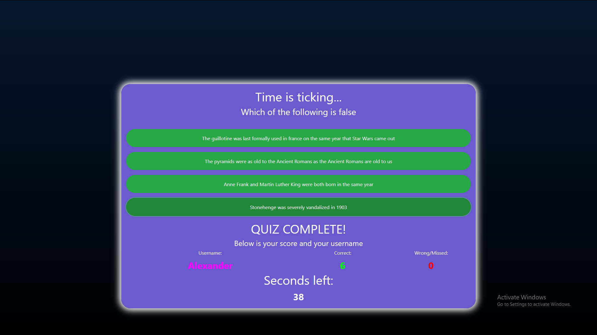

# CodeQuizHomework

I am making a short quiz so i can demonstrate my skills in Javascript and Jquery. 
Here is a link to the functional application: https://alex-waite.github.io/CodeQuizHomework/
below is a screenshot of the working application

# BUGS I AM AWARE OF AND TRYING TO FIX
 
_Upon timeout Wrong Score does not display missed answers_
 

# FEATURES I PLAN ON ADDING
_An indicator that shows if you got a question right or wrong_
 
_Custom Animation_
 
_Replace Prompts with a custom UI_
 
_Last score and username are saved in local storage_
 

# Made with love by Alex Waite, Last edit ~ 16/03/2020